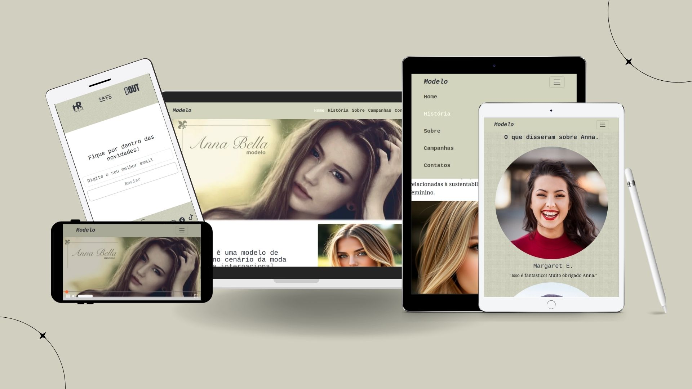

# Landing Page para Modelo - Anna Bela



Este é o repositório oficial do website de **Anna Bela**, uma modelo renomada no cenário da moda nacional e internacional. O site foi desenvolvido em **HTML** e **CSS** com o objetivo de oferecer uma plataforma elegante e responsiva para apresentar a biografia, campanhas publicitárias e informações de contato de Anna Bela.

## 🖥️ **Tecnologias Utilizadas**

- **HTML5**: Estrutura principal do site.
- **CSS3 e Bootstrap5**: Estilos customizados e design responsivo.
- **Fontes e Ícones**: Integração com Google Fonts e ícones do Bootstrap 5.
- **Imagens**: Utilização de imagens de alta qualidade para campanhas publicitárias e portfólio.

## 📁 **Estrutura de Pastas**

```
assets/
   /css                # Arquivos de estilo CSS
      /style.css
   /images           # Imagens das campanhas publicitárias, biografia e branding
      /gallery
      /history
      /sponsors
      /testimonials
      /capa.webp
      /fundo.webp
/index.html         # Página inicial
```

## 🚀 **Como Executar o Projeto Localmente**

1. **Clone o repositório:**

   ```bash
   git clone https://github.com/leonardobarrosdev/Annabela-website.git
   ```

2. **Navegue até a pasta do projeto:**

   ```bash
   cd Annabela-website
   ```

3. **Abra o arquivo `index.html` no seu navegador:**

   - Caso esteja utilizando um ambiente local de desenvolvimento como o Visual Studio Code, você pode utilizar a extensão "Live Server" para abrir o projeto com recarregamento em tempo real.
   
   Ou, simplesmente:

   ```bash
   open index.html
   ```

4. **Personalize conforme necessário:**
   - Você pode modificar os arquivos HTML e CSS conforme sua necessidade, adicionando novas seções, alterando o layout, ou integrando outros recursos.

## 🌟 **Funcionalidades**

- **Página Inicial**: Apresentação visual e elegante de Anna Bela, com links para as principais seções.
- **Biografia**: Um resumo da carreira e trajetória da modelo.
- **Campanhas Publicitárias**: Galeria com imagens das principais campanhas de Anna Bela.
- **Contato**: Informações para entrar em contato com Anna Bela para propostas comerciais, desfiles ou colaborações.

## 🖌️ **Personalização**

O site utiliza um design minimalista e moderno, que pode ser facilmente modificado para incluir novas campanhas, fotos e informações. Para isso:

- Edite os arquivos de estilo na pasta `/assets/css`.
- Substitua as imagens na pasta `/assets/images`.

## 🔗 **Deploy**

Este site pode ser facilmente hospedado em plataformas como GitHub Pages, Netlify ou qualquer outro serviço de hospedagem estática.

## 📝 **Licença**

Este projeto é licenciado sob a [MIT License](LICENSE), permitindo o uso livre e modificação, desde que os direitos autorais sejam mantidos.

---

Se precisar de mais ajuda, é só me avisar!